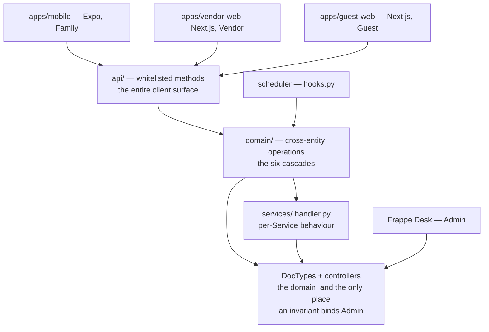
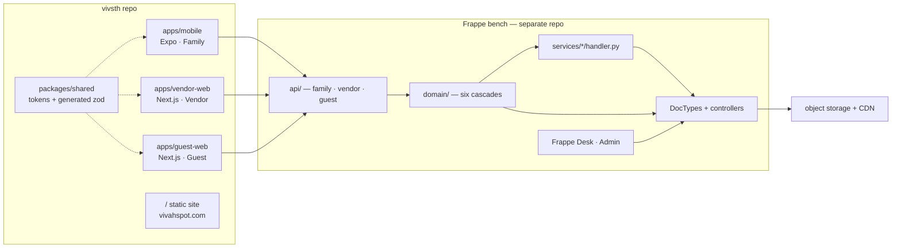
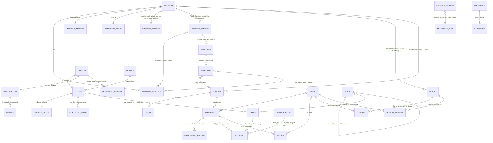

# Architecture Spine — Vivah Spot

Fixes only what two independently-built units could otherwise choose incompatibly. Everything structural below is seed: true at cold start, owned by the code once it exists.

`UH-n` / `CL-n` cite `coding-standards.md`. `FR-n` / `NFR n.n` / `UJ-n` cite `prd.md`, whose Glossary §3 is binding vocabulary. Frappe mechanics are owned by the six `frappe-*` skills — cited, never restated.

## Design Paradigm

**Document-centric core behind a versioned RPC façade.** Five layers; the dependency arrow points one way only (UH-13).



A controller never imports `domain/`, `services/` or `api/`. A handler never imports transport. **Frappe Desk is not a client** — it sits directly on the DocTypes, which is what makes FR-62's configuration editing free *and* what makes AD-27 mandatory.

## Invariants & Rules

Each rule names **what actually enforces it, and whether that exists today**. Tier numbers from `coding-standards.md` §4 appear only where they genuinely map — that ladder is about catching authoring mistakes, and most enforcement here is runtime (a database constraint, a controller guard, a startup check), which the ladder was never meant to cover and which is stronger than an edit-time hook rather than equal to it. Under UH-14 a rule no machine can see broken is a convention, and `DEFERRED.md` D-5 and D-6 record that almost nothing is gated today.

### AD-1 — The dependency arrow never reverses

- **Binds:** all backend code
- **Prevents:** a controller reaching upward; business rules migrating into clients
- **Rule:** Imports flow clients → `api/` → `domain/` → `services/` → DocTypes. The scheduler enters at `domain/`. No module imports a layer above it. Frappe Desk consumes DocTypes directly and is never a client of `api/`.
- **Enforced by:** import-restriction lint on the backend app — **does not exist**, see Deferred

### AD-2 — Clients call purpose-built methods only

- **Binds:** all three clients, every client-facing endpoint
- **Prevents:** the database schema becoming the public API; a field rename breaking installed apps; and a client being *able* to hold a rule the server should own — though neither this AD nor AD-1 can see client code, both being backend rules. Only a rule that names a forbidden operation reaches across the repo boundary, which is why AD-19 says "clients never do money arithmetic" rather than "business logic lives on the server"
- **Rule:** No client calls `/api/v2/document/:doctype`. Every client read and write goes through a whitelisted method under `api/`. This holds for the vendor portal too: redeployability solves schema drift only — not FR-57's five-vendor aggregate floor, not surface width (CL-10, UH-12), and not FR-43's requirement that no `PATCH` on an Agreement exist at all.
- **Enforced by:** review only; `CLAUDE.md` §2 carries the rule

### AD-3 — A version segment exists only where the client cannot be redeployed

- **Binds:** `api/` namespace layout, every client
- **Prevents:** the vendor portal's evolution being gated by the phone's release cycle; an agent symmetrising the namespaces and erasing the signal
- **Rule:** `api/family/v1/` is frozen once shipped — a breaking change adds `v2` beside it and never edits `v1` in place. `api/vendor/` and `api/guest/` carry **no** version segment, because those clients redeploy with the backend. The absence of a segment is meaningful and must not be "corrected".
- **Enforced by:** review only

### AD-4 — The annotated Python signature is the contract; zod is generated from it

- **Binds:** `api/**`, `packages/shared`, all three clients
- **Prevents:** two representations of one request/response shape drifting apart across two repositories, failing at runtime on a phone that cannot be redeployed (UH-6)
- **Rule:** Every whitelisted method carries full type annotations, and **both halves are checked** — which is what makes them load-bearing rather than documentation. Frappe covers only the request half: `validate_argument_types` (`utils/typing_validations.py:25`, applied at `__init__.py:463`) coerces and validates **arguments**, and explicitly skips a function whose only annotation is a return type (`:103`). So **`api/` methods carry our own decorator that validates the returned value against its own annotation**, active in development and test where a mismatch fails the build, off in production where it would tax every request. Without it the generator would emit a response schema from an annotation nothing checks, and the three clients would parse against a guarantee that does not exist. A bench script emits `contract/family.v1.json` into this repo; zod schemas in `packages/shared` are **generated** from it, never hand-written. Drift becomes a reviewable diff. Supersedes Tech-Stack §7's hand-maintained mirror.
- **Enforced by:** a codegen diff in the commit gate — **generator not yet built**, see Deferred

### AD-5 — Service behaviour lives in a per-Service handler module `[ADOPTED]`

- **Binds:** every Service in the catalog; availability, pricing, sizing, order basis, FR-71 required capabilities
- **Prevents:** two handlers for two Services inventing two different shapes; per-Service logic scattered across the façade and the controllers
- **Rule:** Each Service's behaviour lives in exactly one module, `services/<service>/handler.py`, reached through a registry keyed by Service and implementing one declared interface. No Service-specific branch appears anywhere else — not in the façade, not in `domain/`, not in a controller, not in a client. A Service whose handler is missing or fails the interface check **fails the deploy**, checked in `after_migrate` — no Frappe hook runs at process startup, so "refuses to boot" is not available; failing the migration is.
- **Enforced by:** the registry and interface check in `after_migrate` — it fails the deploy; plus review
- **Accepted cost:** FR-62 and UJ-4 promise Admin ships a Service "without a developer and without a release". Under AD-5 that holds for a Service's *declarations* (AD-8) and not for its *behaviour* or its *field set* (AD-6). Chosen deliberately on a bounded catalog of 50–60 that is not expected to grow. The PRD needs amending.

### AD-6 — One Listing core, one detail DocType per Service

- **Binds:** Listing, every Service, discovery, comparison, search
- **Prevents:** fifty Listing DocTypes and a fifty-way union on every cross-Service read; and the divergence two epics would actually hit — one storing Service attributes as config rows while another stores them as columns
- **Rule:** A single `Listing` DocType holds what every Service has — Vendor, Service, all-in price, Commitment, verification state, portfolio, Place coverage (Rules attach per AD-36). Each Service adds **one** detail DocType, 1:1 with Listing, whose fields are **real indexed columns**. There is no second storage shape for Service attributes: no key/value child table, no JSON blob. Adding or removing a field is a schema change and therefore a release. Cross-Service reads (Block matching, running budget, Workspace) touch only the core.
- **Enforced by:** `frappe-doctype` validation; review

### AD-7 — Shared behaviour is discovered from handlers, never guessed ahead of them

- **Binds:** `services/**`
- **Prevents:** fifty near-copies accumulating unreviewed; and a speculative engine built before three concrete cases exist
- **Rule:** UH-9 governs the handlers: the third occurrence forces extraction or a written reason. Extraction is its own structural commit (UH-1).
- **Enforced by:** a duplication threshold in CI — **does not exist**, see Deferred; plus review

### AD-8 — A Service's declarations are data; its behaviour and field set are not

- **Binds:** FR-14, FR-18, FR-21, FR-33, FR-50, FR-62
- **Prevents:** AD-5 being read as licence to hard-code everything per Service; and its opposite, a handler inventing an Engagement Model the Service row does not declare
- **Rule:** These are Admin-editable data on the Service row, changed with no code release, and the handler **reads** them rather than hard-coding them: **Engagement Model** (one of FR-14's five), **Sizing Attribute**, **Order Basis**, **pricing model**, whether the Service has Spaces, and which of the detail DocType's columns are exposed as filters and as comparison attributes. Also data, elsewhere: Subscription price per Service × Place × Tier, portfolio allowance per Tier, opening a Place at any level. **Not data:** the field set itself (AD-6) and behaviour (AD-5). Of the declarations above, **Engagement Model and has-Spaces are the behaviour pair** — they decide what an occupancy row means. **Order Basis and pricing model are arithmetic**: they feed AD-19's `recompute_budget` and the quote a Vendor prices against. Changing one **re-derives figures but never restates a price a Vendor authored** — an all-in price written under a per-unit model does not mean the same number under a per-head one, so existing Listings keep their authored price and their Vendor is asked to restate it before the Listing publishes again, exactly as FR-62 handles a Listing a configuration change left incomplete.

  **The Service row is read live, and that has a stated cost.** For the *presentational* declarations — filters, comparison attributes, Sizing Attribute display — FR-62 holds as written: existing Listings, Shortlists, Enquiries and Agreements keep the shape they were created under, and where a change would make a published Listing incomplete, that Listing keeps its published state and its Vendor is asked to supply what is now needed.

  For the *behaviour* declarations — Engagement Model, has-Spaces — **it does not.** AD-10 and AD-11 read the current value, so changing one reinterprets occupancy rows already written: a per-Function Service switched to Span turns two separate engagements into one continuous hold including the night between. Treat a change to a behaviour declaration on a Service that already has Listings as a data migration, not a configuration edit.
- **Enforced by:** the handler interface check; plus review

### AD-9 — Wedding time is a day and a Slot; only non-Slot Engagement Models carry dates

- **Binds:** Function, Candidate Block, Chosen Block, occupancy, Agreement, all matching
- **Prevents:** timezone and DST bugs entering the calculation the product exists to get right; and, equally, a rental-period or lead-time Service being forced into a Slot model that cannot express it
- **Rule:** A Function holds a `DATE` and a `Slot` enum (morning, afternoon, evening, night — the same four for every Service, FR-28). Span and per-Function matching read **only** those two, and no datetime appears anywhere in them. Rental-period Services carry a `DATE` range and lead-time Services a required-by `DATE`; neither carries a time of day. A Function's optional display-time field exists for the invitation (UJ-5), is never read by matching, and never travels to a Vendor as a constraint. Timestamps are for records — Agreement confirmation, audit entries — never for the wedding.
- **Enforced by:** DocType field types; plus review

### AD-10 — Availability is computed in one place, per Service, per Engagement Model

- **Binds:** FR-13, FR-14, FR-15, FR-21, FR-23, FR-28, FR-53; discovery, comparison, shortlists, enquiries
- **Prevents:** four surfaces answering "is this vendor free" differently; a stale cache showing a Family a vendor who is not free; and the Venue-shaped engine `service-shapes-analysis.md` warns of — one that answers correctly for Venue and wrongly for the other four models
- **Rule:** Only blocking facts are stored. Availability is evaluated by **one** server-side function, which dispatches on the Service's declared Engagement Model (AD-8) and evaluates **only the Functions that Service serves within the Block** — never the whole Block. No materialised matrix, no cache.

  **"Free" means no Vendor block, and seats not exhausted** — `no vendor block on (space, day, slot)` **and** `count(agreement-held rows) < concurrent_capacity`, never `NOT EXISTS` (AD-11). Both halves are load-bearing: reading it as absence defeats crew bandwidth, and counting a Vendor's block as one seat reads a capacity-2 photographer as available on the day he blocked.

  | Engagement Model | Question asked |
  | --- | --- |
  | Span | Is every `(day, slot)` from the first served Function's start to the last one's end free — intervening and overnight Slots included? |
  | per Function | Is each served Function's own `(day, slot)` free? |
  | rental period | Is the required date range free, per inventory item? |
  | lead time | Can the Vendor deliver by the required date, given the Commitment timeline? No occupancy is consulted. |
  | no duration | Excluded from matching. Presented **without an availability claim** — never as unavailable. The only signal is whether the Vendor is currently accepting Enquiries (FR-28). |

  Where a Service has Spaces, availability is evaluated **per Space** and a Listing is available if any of its Spaces is — Dattatray's lawn being held does not make his hall unavailable (FR-23).

  The same function applies FR-13's subscription gate **by calling AD-35** rather than restating it: a Listing past its Grace Period shows no dates, because it is not discoverable; Founding Vendor at ₹0 is an active Subscription and shows dates like any other. A Family with no Anchor Date yet sees Listings **without** an availability signal, not as unavailable.

  **No surface ever asserts availability as fact.** Every rendering is attributed to the Vendor — "shows available" — because freshness rests on FR-29's nudge and nothing stronger (NFR 5.6, FR-13, FR-19). The function returns an attributed signal, never a boolean a caller can relabel.
- **Enforced by:** the single call site is the check; plus review

### AD-11 — Concurrency is a database constraint, and capacity is part of it

- **Binds:** FR-14, FR-28, FR-39, FR-40, FR-42, FR-69
- **Prevents:** two Vendors confirming the same Slot in separate workers and both passing a `SELECT`-then-`INSERT`; and a crew-bandwidth Vendor being capped at one engagement per Slot when a photographer can shoot two weddings a day
- **Rule:** Occupancy is one row per `(space, day, slot, seat)` with a `UNIQUE` index over all four. **Every bookable thing is a `Space`** — a Service with real Spaces has them already (a lawn, an AC hall); a Service without gets **one implicit Space per Listing**; a rental-period Service's **inventory item is a Space**, because one lehenga is one lehenga. So the column points at exactly one DocType and the index is genuinely unique. Frappe `name` values are unique **per DocType, not globally**, so a polymorphic `resource` over three parents would let a Listing and a Space collide on one key — and this AD's enforcement claim is only as good as its column list. Every Space carries an explicit `concurrent_capacity` — never on a per-Service detail DocType, because AD-6 keeps cross-Service reads on the core and occupancy insertion is one. It is **declared by the Vendor, minimum 1, and never implicitly defaulted**: a lawn declares 1, a photographer declares the weddings they will shoot in a Slot, a caterer declares the Functions they will serve in one. `seat` runs `0..concurrent_capacity-1`, and **every row carries `held_by`**, typed as `Agreement` **or** `Vendor Block` and never a bare id — an Agreement, or a Vendor's own block (FR-28 lets a Vendor block Slots for maintenance or family use without stating a reason). **A Vendor's block fills every seat: blocking a Slot writes one row per seat**, so at `concurrent_capacity` 2 it writes two. The existing unique index is then the whole enforcement — any Agreement trying either seat hits a violation, and nothing is left to an application check that two workers could both pass. Treating a block as a single seat would leave a capacity-2 photographer bookable on the day he blocked for his daughter's wedding, because seat 1 would still be free. **A partial block falls out of the same mechanism**: write one row and the Vendor keeps selling the other crew. The retry branch has three cases: the same Agreement is a no-op, another Agreement advances a seat, and a Vendor block declines outright. Confirmation takes the lowest free seat, so two workers racing for seat 1 with seat 2 free do not both fail, and a retried confirmation never quietly consumes a second seat (AD-31).

  **Written in one transaction, nothing written on decline.** A Span occupies many `(day, slot)` rows; each takes **the lowest free seat on its own row**, because forcing one seat across the whole closure would decline a Span the Vendor can serve — crew 0 booked on the 25th and crew 1 on the 26th leaves no single seat free across both, on the very multi-crew case this AD exists for. The set is inserted atomically, so a retry sees either the complete set or none of it, and **a retry re-derives the closure and compares its cardinality to the rows held; a mismatch is a defect, not a success** — the Family may have moved a Function (FR-9, FR-17) between attempts, so the old rows must not be mistaken for the new closure. Without that, `held_by` cannot distinguish *already done* from *half done*: a retried Span confirmation would find its own first row, report success, and hold a partial closure while the rest of the wedding went to somebody else. `held_by` is also what makes release and amendment addressable: cancellation deletes the rows held by that Agreement and nothing else.

  A **Span** expands to one row per `(day, slot)` it occupies, from the first served Function's start Slot to the last one's end Slot, **inclusive of every Slot between them and the overnights** — so the overnight FR-14 says is unsellable cannot be sold. A **rental period** expands to one row per day in the range with the sentinel Slot value `all-day`; the Slot column is **never NULL**, because MariaDB permits unlimited duplicate NULLs in a UNIQUE index and the constraint would silently never fire. **Lead-time and no-duration Services create no occupancy rows.** When every seat is taken the Vendor is told which engagement conflicts (FR-39), and the Family's proposed terms return to the thread as declined-by-conflict, never silently expired.
- **Enforced by:** **the database** — a unique index, which no code path can talk past

### AD-12 — A confirmed Agreement is frozen, and an Amendment never cancels it

- **Binds:** FR-39, FR-40, FR-42, FR-43, FR-69, NFR 5.7
- **Prevents:** an eight-year-old Agreement being read back through a schema that has since moved; Admin altering confirmed terms; and — the failure that costs a couple their venue — an Amendment travelling through Frappe's cancel-and-amend flow, releasing the occupancy rows, letting a third party take them, and leaving the amendment unconfirmable
- **Rule:** `Agreement` is submittable: both-party confirmation moves `docstatus` 0 → 1. At that moment an `Agreement Record` row stores the **serialised frozen terms verbatim**, **the document rendered from them at that moment, kept as immutable bytes**, the SHA-256 digest **of those rendered bytes**, the digest of the previous row for that Agreement (a hash chain, so a silent edit is detectable), and a server-side timestamp.

  **A chain proves nothing about its own length**, so the `Agreement` itself carries the **head digest** and the **record count**, and `Agreement Record` refuses deletion in `on_trash`. Without both, deleting the last row leaves a perfectly valid chain, silently reverts the Agreement to its previous terms, and passes AD-23's verification sweep. **`Agreement Record` is a DocType of its own and never a child table** — child rows are removed through `update_child_table` with raw SQL and no `on_trash` at all (`document.py:656-683`), so as a child table the refusal would be unreachable. `force=True` does **not** skip `on_trash`; the real bypasses are `frappe.db.delete`/`sql`, `ignore_on_trash` and `for_reload`, and the head digest and count are what still detect those. **An Amendment appends `seq+1` and never touches `docstatus`.** Frappe's built-in cancel-and-amend flow is not used for Agreements at all; `docstatus` 2 means a real cancellation and nothing else. Occupancy release is keyed to the `Cancellation` transition row of AD-26, which `docstatus` 2 now uniquely identifies — the earlier prohibition on `on_cancel` was a fossil of the period when that status was ambiguous between amendment and cancellation, and this AD removed the ambiguity.

  **An Amendment that moves days applies a set difference, in one transaction.** The old occupancy set is compared to the new one: rows in both are left untouched, rows only in the new set are inserted, rows only in the old set are deleted. There is never a moment when the Agreement's own days are unheld, so no third party can take them mid-amendment, and if any new row collides with another Agreement the whole amendment fails and the original days remain held. Delete-then-insert is forbidden — it opens exactly that window — and insert-then-delete is impossible at capacity 1. The transaction uses savepoints, per AD-26. **The chain append is the last step of an amendment**, after the occupancy transform has succeeded. The snapshot is schema-independent, so year eight reproduces year one and the digest still verifies; FR-43's certificate is generated from these rows.

  **The digest covers what the parties actually saw, not only the data behind it.** FR-40 lets both download a copy at any time, and every download returns those same stored bytes — never a re-render. Rendering on demand would make the 2034 copy a different document from the 2026 one as templates, fonts and libraries move, leaving the certificate attesting to a serialisation nobody has ever looked at. One rendered document per Agreement, retained the eight years FR-43 requires, is negligible storage against a record the entire trust model rests on.
- **Enforced by:** a controller guard per AD-27; no update path in `api/` or `domain/`; plus a CL-10 line-by-line human read

### AD-13 — The cancellation count is never derived from `docstatus`

- **Binds:** FR-17, FR-42, FR-60, FR-69, both parties' profiles
- **Prevents:** a cooperative Amendment being recorded as a walk-out on both profiles, permanently and visibly
- **Rule:** FR-42's profile-visible count is **derived from AD-26's `Cancellation` rows and their cause, never stored as a counter** — a counter cannot be rolled, and AD-27's question 2 classifies it as current state recomputed from records that are themselves append-only. It counts actual cancellations only, over a rolling 24 months as a neutral number with no fault attributed or inferred. FR-69 Amendments write nothing to it, because AD-12 keeps an Amendment off `docstatus` entirely so no `Cancellation` row exists to classify. FR-17 date moves do write to it; a cancellation following FR-60 removal is explicitly not counted against the Family.
- **Enforced by:** review only

### AD-14 — Two identity records, never more; erasure clears one of them and nothing else

- **Binds:** NFR 5.5, FR-43, FR-46, FR-47, FR-61, FR-63
- **Prevents:** identifying details copied across records so erasure must find every table, and one missed table is an undiscovered leak
- **Rule:** **[AMENDED 2026-09-12]** There are **exactly two** identity records and a person is in one of them, never both for the same role. An **account holder** — Family, Vendor or Admin staff — is a Frappe `User`, and their number lives in `User.mobile_no` where AD-28 puts it. A **`Guest`** is not a `User` and never becomes one (AD-21, AD-30); their number lives on the `Guest` record. No third shape exists, and no record outside those two copies a person's name or number: everything else links to one of them.

  *(This rule previously read "No record copies a person's name or number; every record references one person record, whose key is opaque (AD-28)". It described a single `Person` record, which contradicted AD-28's `User.mobile_no` as the sign-in lookup key — one number, two homes. Abhishek chose the two-record shape on 2026-09-12: an account holder's number stays on `User`, and the Guest store is named `Guest` after the Glossary term rather than a synonym. The `PERSON` entity in the Structural Seed is retired; the diagram now links `USER` and `GUEST` directly.)*

  **Two consequences follow and neither is optional.** First, **erasure has two code paths, not one** — clearing a `User` and clearing a `Guest` are different operations, and every new person-bearing field must declare which record it hangs off. That is the cost of this shape, accepted deliberately. Second, **a record that can refer to either — `Consent` and `Breach Incident`, which reach people with no account (AD-32) — carries a Dynamic Link naming which of the two it points at**, never a bare id. There is no unique index over that column, so AD-11's warning about polymorphic parents does not apply here; it would apply the moment anyone tries to make one.

  Frappe's `owner` and `modified_by` columns reproduce whatever key they stamp on every row, which is why `User.name` is the opaque synthesised address of AD-28 and never the number. Erasure replaces the identifying fields there with a stable non-identifying token, and every referring record shows the token while keeping its content — a Review keeps its text with the author de-identified, an Agreement keeps its terms, the counterparty loses nothing. NFR 5.5's precedence is implemented here and never re-derived: consent-based data is erased; engagement records and legally-required records are pseudonymised and retained. **A `Guest` record is scoped to one Wedding**, carrying AD-32's retention outcome `erase` for the reason *purpose-limited*. It is **never deduplicated across Weddings and never joined to a `User`** — and under the two-record shape above that is structural rather than a rule anyone enforces: the same person invited to two Weddings is two `Guest` rows, and the same person who later opens an account is a `Guest` row and a `User` with no link between them. FR-12 confines a Guest's details to composing that Wedding's invitations, and a shared row would make audience-building structural and let a guest purge clear a live Vendor's fields. Its trigger is the purpose ending rather than a request: 30 days after the Wedding concludes, immediately on abandonment, immediately when the Creator dismisses a guest-form submission. The token is **stable per record**, so FR-63's repeat-infringer register survives erasure. **[AMENDED 2026-09-12]** It is not stable per *person* across both shapes: an erased `Guest` and an erased `User` for the same human carry different tokens, because nothing joins the two records. A repeat infringer who offends once as a Guest and once as an account holder is therefore two entries in the register, not one. Accepted with the two-record shape — joining them would rebuild the shared row this design removed.
- **Enforced by:** schema review of any new person-bearing field

### AD-15 — Runtime access rules ship as a hook pair, always

- **Binds:** Wedding, Listing, Enquiry, Agreement, Lead Dashboard, every DocType with runtime access rules
- **Prevents:** the list/document mismatch — a row visible in a report that 403s when opened, or a form gate the list knows nothing about so a guessed URL opens the record
- **Rule:** `permission_query_conditions` filters lists, `has_permission` gates documents, and **neither runs on the other's path**. Any DocType needing a runtime rule registers both, applying the same rule. `has_permission` cannot grant — only decline to deny — and every hook returns an explicit boolean, because `None` denies. Query fragments escape with `frappe.db.escape()`, prefix every column with its table, and return `"1=0"` rather than `""` when a lookup is empty. Mechanics belong to `frappe-permissions`.
- **Enforced by:** `frappe-permissions/scripts/audit_permissions.py` in the commit gate — tier 2, **once wired**

### AD-16 — `frappe.get_all` is a security boundary

- **Binds:** all backend code
- **Prevents:** silently returning records the caller may never see, with no error and no empty result to notice
- **Rule:** `frappe.get_all` forces `ignore_permissions=True` and removes the row cap. Three categories, and every read is one of them:

  | Read | Call | Why |
  | --- | --- | --- |
  | Derived from a request | `frappe.get_list` | Every permission layer applies |
  | System work — a scheduled job, a migration, an aggregate no user reads | `frappe.get_all`, with a comment saying which | No user is asking |
  | **A cascade (AD-26)** | `frappe.get_all`, for the duration of the cascade **operation** | It is triggered by one person but must act on every affected record — a lapse cascade running as the Vendor cannot see the Families holding his Listing, so FR-53 would notify nobody and report success |

  **The bypass is established at the cascade's entry point and released there.** The transition row's `doc_events` handler *is* that entry point: it enters a named context for that one cascade invocation and exits it in a `finally`. It cannot be threaded as an argument, because Frappe's own frames sit between a cascade and its reads — `save` → `on_update` → `recompute_discoverable` → row `insert` → `doc_events` puts four of them between cascade 5 and cascade 4, and an unset flag there means FR-53 notifies nobody and reports success. It cannot be a bare `frappe.flags` either: that is per-`frappe.init()`, so a flag left set by an exception path returns unauthorised rows to the next request on that worker. The context manager is what bounds it. **Every write a cascade makes still records the person who triggered it**, so FR-61's attribution survives the wider read. `frappe.db.get_value`, `set_value` and `sql` sit below the permission layer entirely and check nothing, masking included.
- **Enforced by:** `frappe-whitelisted/scripts/check_whitelisted.py` in the commit gate — tier 2, **once wired**

### AD-17 — Wedding access is a membership table, and document sharing is off

- **Binds:** FR-5, FR-6, Wedding, Workspace, Board, guest list
- **Prevents:** a DocShare row ORing past every isolation rule; and the impossibility of expressing "may view everything, may commit to nothing" in Frappe's fixed share rights
- **Rule:** A `Wedding Member` child table holds the Creator and Invited Members with an explicit role, and the AD-15 hook pair reads it. `disable_document_sharing` is **on** site-wide. In v16.33 a share is OR-ed around the query conditions on the list path (`db_query.py`) and grants on the document path (`permissions.py`), so one DocShare row escapes User Permissions and every `permission_query_conditions` hook — and FR-5 promises a Wedding cannot be reached by anyone not given access.
- **Enforced by:** a System Settings value; plus `audit_permissions.py` — **once wired**

### AD-18 — Every whitelisted method carries its own gate

- **Binds:** `api/**`
- **Prevents:** a method that works and is exploitable — returning another user's documents to anyone who guesses a name
- **Rule:** `@frappe.whitelist()` establishes only that someone is logged in; it checks no DocType, no document and no role. Every method gates every document it touches, **before** it reads data. Action rules the framework has no home for — FR-6's Creator-only enquiry, contact reveal, confirmation, cancellation and review — live in one guard module called at the top of the method. `methods=` is always restricted: Frappe commits only on POST/PUT/PATCH/DELETE, so a `GET` handler that writes has its writes rolled back, and CSRF is validated only on those verbs. **A gate that must also bind Admin belongs in the controller instead — see AD-27.** Mechanics belong to `frappe-whitelisted`.
- **Enforced by:** `check_whitelisted.py` — **once wired**; plus a CL-10 human read

### AD-19 — Money is Frappe Currency; paise exist only at Razorpay; clients never compute it

- **Binds:** Listing price, Space price, seasonal pricing, Quote, Agreement, running budget, Subscription, Invoice
- **Prevents:** mixed money units, the most expensive bug class per line that causes them (UH-7); float64 error accumulating over a fifteen-line budget total
- **Rule:** Every money field is Frappe `Currency` in rupees, so Desk formatting, print formats, reports and FR-52's GST invoicing work natively. Conversion to integer paise happens at the Razorpay call and nowhere else. **Clients never do money arithmetic** — every total, per-head multiplication and budget rollup is computed server-side where Currency is exact decimal; clients receive a number and render it.

  **The running budget has one writer: `recompute_budget(wedding)`.** Nothing else writes the total — not a cascade, not a controller, not a client. It totals Selections and confirmed Agreements only (never Shortlist entries, FR-8), counts a Span Selection **once** for the whole Span however many Functions it covers, and multiplies a per-head price by the stated guest count of the Functions that Service serves. A Service whose Functions are undecided reads *not yet estimated*, never ₹0. FR-8 grants two distinct acts and they are modelled distinctly: an **adjustment is an override column on the `Selection`** which the function reads *in place of* the derived figure rather than recomputing over it, and an **addition appends** a cost the platform knows nothing about, which the function includes and never overwrites. Both are sticky: FR-8 says every automatic figure is usable as-is, which means a figure she corrected stays corrected. Collapsing both into extra rows double-counts every correction.

  **It is invoked from `Selection`, `Agreement`, `Wedding Function` (stated guest counts) and the Family's own rows.** **`Listing` is deliberately not an invoker:** a Selection stores the price at the moment the Family picked it (FR-8), so a Vendor raising his per-head rate does not silently re-price weddings already planned — and the alternative is an unbounded cross-Wedding fan-out inside a Vendor's own save, running as a Vendor who cannot see those Weddings and therefore resolving nothing — the same enumerate-your-inputs treatment AD-35 carries. **The total lives on its own `Wedding Budget` document**, written as a **field update, not a document save** — so it raises no `Wedding.on_update` (and no cascade 1 or 6), and `check_if_latest` (`document.py:1088`) cannot fail one of two Vendors confirming into the same Wedding for a reason unconnected to his Agreement. **The recompute takes a row lock on that document before it reads and holds it to commit**, so read and write are one serialised step: a second confirmation waits, then reads a state that already includes the first. Without the lock, last-write-wins is not merely lossy but *permanently* wrong — a worker reading before another's Agreement commits and writing after it has leaves a total missing that Agreement for good, and nothing would necessarily recompute again, because a Family who has finished selecting never triggers one. The single display formatter lives in `packages/shared`.
- **Enforced by:** review only; resolves `DEFERRED.md` D-3 and D-4

### AD-20 — Verification gates each item, not the Listing

- **Binds:** FR-27, FR-50, FR-58, FR-70, UJ-4
- **Prevents:** a Vendor passing Verification with real photographs and replacing them the next day; and, oppositely, a Vendor vanishing from the platform for days because he uploaded one photo
- **Rule:** The verified set is enumerated once — identity, business registration, portfolio images, Spaces with their capacities and Stated Sizes. Each verifiable item carries its own state and the public read path filters on it: a new photo is hidden while the rest of the Listing stays live and keeps receiving Enquiries. A change of **identity** is the sole exception that takes the whole Listing pending. Price, Rules, Commitment, calendar and seasonal pricing are Vendor declarations, are not verified, and publish immediately. **`is_publicly_visible(image)` is the only statement of image visibility**, owned here and called by AD-29 at the storage layer — three terms: **verified**, **within the Tier's allowance**, and **neither taken down (AD-33) nor belonging to a Vendor removed by Admin (FR-60)**. **Discoverability is deliberately not a term, but two exits from discovery are.** A Listing that lapses or is withdrawn by its Vendor keeps its images served: FR-53 promises the portfolio "reappears intact on renewal" and keeps the open Enquiry threads answerable, so the Family still corresponding must still see it. **Admin removal (FR-60) and takedown (FR-63) both demote the media**, because in those two the content itself is the problem — FR-60 draws exactly this line, "true of a late payer and **false of a fraud**", and a removed fraud's stolen photographs must not stay on a public URL that never expires. A Listing over its allowance keeps every image (FR-27); the published set is the **first N of the Vendor's own ordering — defaulting to upload order — taken over the **verified** images**, with taken-down images then removed from the published set. So a pending image never consumes a slot the Vendor paid for, and **a takedown leaves its gap rather than promoting an image nobody chose to publish** — a court order must not cause a publication. Ranking the whole set instead would let an unverified upload silently cost a published slot.
- **Enforced by:** one public read path; AD-29 at the storage layer; plus review

### AD-21 — Outbound messaging cannot address a Guest

- **Binds:** FR-11, FR-12, FR-29, FR-35, FR-53, UJ-5, all notifications
- **Prevents:** the WhatsApp Business account being restricted — the same account every Vendor Enquiry notification depends on, so one breach takes down the vendor side of the product
- **Rule:** The outbound messaging function's recipient is a **link to a `User` record**, and AD-30 establishes that a Guest is never a Frappe user — so there is no value to pass, and a bad link is a database error rather than a rule someone remembered. A Python annotation would not do this: it is inert at runtime, and `DEFERRED.md` D-6 records the backend has no type checker to read it. Composing an invitation is a separate path returning text and a link **to the Family**, who sends it from their own WhatsApp. Template categories are declared per message type, because utility and marketing bill and gate differently.
- **Enforced by:** **the link constraint** — a Guest has no `User` record to reference, so the database refuses

### AD-22 — The result-order seed is fixed per search

- **Binds:** FR-20, discovery, pagination
- **Prevents:** the list reshuffling under a scrolling Family so she sees one Listing twice and never sees another — on every scroll, for every Family, in every Service
- **Rule:** FR-20's rotation among near-equals is a tie-break shuffle seeded once when a Family opens a Service's results, held for that browsing session, re-seeded on a new search. Ordering above the tie-break is fixed: availability, then rating shrunk toward the average for that Service **at the Listing's own Place level** — a result set spanning levels shrinks each Listing toward its own level's population, and where none exists FR-20's ladder applies (the Service across all Places, then the platform, then the remaining signals alone), then median first-reply time, then verification freshness. Neither what a Vendor pays nor how recently they joined is a signal at any weight. Featured placement is a separate marked band, never inside the organic ordering.
- **Enforced by:** review only

### AD-23 — Time-triggered rules are enumerated in one place

- **Binds:** FR-29, FR-35, FR-45, FR-48, FR-51, FR-53, FR-63, FR-72, NFR 5.5
- **Prevents:** a requirement with a time trigger silently never shipping, because nothing fails when one is absent
- **Rule:** **Any rule with a time trigger is registered in one `scheduler_events` block.** That is the invariant; the roster is not restated here, because it is derivable and an enumeration in this document has lagged the rule three times. The PRD carries most of it — FR-29's nudge, FR-35's unanswered Enquiry, FR-45 and FR-48's review window, FR-51's cohort expiry, FR-53's Grace Period, FR-63's SLA clocks and quarterly advisory, FR-72's conclusion and abandonment, NFR 5.5's Guest erasure. **Five exist only because this spine created them** and would otherwise be found by nobody: **AD-26's outbox dispatcher**, without which no cascade's effect is ever sent; AD-33's 180-day purge of removed content; AD-12's hash-chain verification sweep; AD-12's eight-year retention expiry; and AD-30's guest-link expiry. Every job is idempotent (AD-31), skips anything under legal hold (AD-33), and raises a transition row rather than performing cascade work itself (AD-26) — the outbox dispatcher being the one exception, since dispatching an already-recorded effect is not cascade work.
- **Enforced by:** review only; a job with no listing is the defect

### AD-24 — The Glossary is binding, and the banned words are gated

- **Binds:** every DocType name, every field name, every zod schema, every UI string, all copy
- **Prevents:** the same entity acquiring two names across epics; and the words that create the liability the no-money model exists to avoid appearing on a shipped screen
- **Rule:** `prd.md` §3 fixes the vocabulary — `Listing`, `Service`, `Space`, `Slot`, `Span`, `Candidate Block`, `Chosen Block`, `Shortlist`, `Selection`, `Enquiry`, `Quote`, `Agreement`, `Amendment`, `Commitment`, `Rules`, `Subscription`, `Tier`, `Verification`. `CLAUDE.md` §6's noun list (`Vendor Listing`, `Package`, `Availability Block`, `Service Category`) is inherited from the superseded Tech-Stack §3 model and is retired.

  **The Glossary binds domain entities; mechanism records are named freely and must not shadow it.** A transition row, an outbox entry or a derived projection is architecture, not product vocabulary — `Block Change`, `Rule Acceptance`, `Rule Conflict`, `Cancellation`, `Listing Condition Change`, `Vendor Removal`, `Wedding State Change`, `Vendor Block`, `Cascade Outbox` and `Wedding Budget` are all of that kind. None may reuse a Glossary term for a different meaning, and none appears in copy a Family or Vendor reads.

  A pre-commit gate blocks *book now, booking, booked, cart, checkout, legally binding, guaranteed, enforced by Vivah Spot* across `apps/`, `packages/` and the root `.html` files, exempting PRD §7.1 and §7.9 which quote them in order to ban them. **It cannot reach the backend**, which is a bench in another repository — that app carries its own copy of the same check, and until it does the ban is a convention there (`DEFERRED.md` D-6, D-13).
- **Enforced by:** a pre-commit vocabulary gate — **to be built**; it fails today on the published site

### AD-25 — Configuration comes from the environment

- **Binds:** all repos, all deployables
- **Prevents:** MSG91, Razorpay, WhatsApp and object-storage credentials entering a repository, where rotation is the only remedy
- **Rule:** UH-16, unmodified: the repository holds only the shape of configuration.
- **Enforced by:** pre-commit secret scanning — **does not exist**, `DEFERRED.md` D-5

### AD-26 — Cross-entity cascades live in `domain/`, and there are six of them

- **Binds:** FR-17, FR-32, FR-42, FR-53, FR-60, FR-72
- **Prevents:** the same cascade written two or three times because it is reachable from `api/`, the scheduler and Desk with no shared layer authorised to hold it — and FR-53's promise that no route removes a Listing from a Family's view without telling them silently failing on the route nobody wired
- **Rule:** Operations spanning more than one entity live in `domain/`, and each has exactly one implementation.

  **Invocation.** A cascade is invoked by `doc_events` on its **transition row** — never by a direct call from `api/`, and never by binding the affected document directly. Where the transition is a document lifecycle event, the row is written **by that document's controller**, in the hook that fires for every actor — `on_cancel` for a cancellation, `on_update` guarded by `has_value_changed` for a field transition. AD-27 governs: the row is the integrity constraint, so it lives where Desk cannot walk past it. `api/` and the scheduler write a transition row **only** where no document change exists to hang it on.

  **A transition row** names the entity, the transition and its **direction**, and carries an **occurrence id** — the id of the event that caused it, or a monotonic sequence where none exists. Uniqueness is `(entity, transition, direction, occurrence)`. That dedups a double write of one event while leaving a **legitimate repeat** free to insert: FR-17 lets a Family move the Chosen Block at any time and FR-59 lets a Listing re-enter discovery, so a key derived from the transition alone would silently drop the third Block move and the second exit.

  **Its controller asserts the transition actually occurred:**

  | Row | Assertion | Written by |
  | --- | --- | --- |
  | `Cancellation` | `Agreement` at `docstatus` 2 | `Agreement` controller, in `on_cancel` |
  | `Listing Condition Change` | the row's `from`/`to` matches the flag transition `recompute_discoverable` wrote in this transaction | `Listing` controller |
  | `Rule Acceptance` | the Family accepted, naming the set she was shown — **not** a confirmed Agreement, which FR-32 puts strictly later | `api/`, at acceptance |
  | `Block Change` | the derived day-set differs from the stored one | `recompute_chosen_days`, from either controller |
  | `Vendor Removal`, `Wedding State Change` | `not is_new()` **and** `has_value_changed(…)` | the owning controller |

  **Cascade 1's transition is a derived set, not a field.** `chosen_block` is a link, and AD-9 puts the day and Slot on the Function — so a Family moving the Sangeet from the 25th to the 27th changes no `Wedding` field, and a binding on `chosen_block` would never fire while Agreements stood against days the wedding had left. `recompute_chosen_days(wedding)` computes the `(day, slot)` set the Chosen Block occupies, compares it to the set stored on the Wedding, and raises a `Block Change` row carrying the old and new sets **only on a genuine difference** — the same compare-and-return shape as `recompute_discoverable`, and the reason a second edit of one Function to the same day is not a duplicate-key error. It binds from `Wedding` (the link changed) and from `Wedding Function` (a day or Slot changed). This is what AD-11's closure test already assumes when it says the Family may have moved a Function between attempts.

  **`not is_new()` is not optional:** `has_value_changed` returns `True` on insert (`document.py:705`, `_doc_before_save` unset at `:1426`) and `on_update` runs on the insert path — so without it, creating a Wedding fires cascades 1 and 6 and creating a Vendor fires cascade 5.

  **The `Cancellation` cause is derived, never passed.** Frappe's `cancel()` takes no parameter, so `on_cancel` reads what it can see: a Chosen Block changed in this transaction is FR-17 (counted); a removed Vendor is FR-60 (explicitly not counted against the Family); anything else is party-initiated. An Admin cancelling in Desk supplies nothing and AD-13 still counts correctly.

  Naming the transition is what makes the Desk route and the API route the same route.

  | Cascade | Its transition |
  | --- | --- |
  | 1 · Chosen Block change (FR-17) | `Block Change` row — raised by `recompute_chosen_days`, bound from **both** `Wedding` and `Wedding Function` |
  | 2 · A conflicting Rule takes effect (FR-32) | `Rule Conflict` row — written by the **`Agreement` controller** on confirmation. Its **input** is the `Rule Acceptance` row, written *at acceptance* with the set the Family was shown |
  | 3 · Cancelling an Agreement (FR-42) | `Cancellation` row — written by the **`Agreement` controller** in `on_cancel`, so Desk cannot walk past it |
  | 4 · A Listing **enters or leaves** discovery (FR-53, FR-59) | `Listing Condition Change` row — written by the **`Listing` controller** whenever `recompute_discoverable` changes the flag, and by nothing else; the lapse job and the Service fan-out act by calling `recompute_discoverable` |
  | 5 · Removing a Vendor (FR-60) | `Vendor Removal` row — `Vendor` controller, on `removed` |
  | 6 · Conclude or abandon a Wedding (FR-72) | `Wedding State Change` row — `Wedding` controller, on `state` |

  Cascade 2 firing on **confirmation** is load-bearing: FR-32 says nothing is removed until the engagement actually completes, so a Family who accepts and then loses the Slot race (FR-39, AD-11) must find her Shortlist, Selections and Agreements exactly as they were.

  **Every cascade is invoked by a transition row — all six, with no exceptions**, so the shape above governs uniformly and AD-31's idempotency reaches the two most destructive operations in the system. Where the trigger *is* a document change, the controller writes the row under a `has_value_changed` predicate; a bare `on_update` is not the transition, and without the predicate every Wedding save would cancel every Agreement in the Wedding.

  **Composition is allowed and stated.** A cascade may call another: **1→3, 2→3, 5→4, 6→3**. The graph is complete because the running budget lives on its own document (AD-19) and so raises neither cascade 1 nor cascade 6. FR-60 removal invokes cascade 4 per Listing; FR-32, FR-17 and FR-72 each cancel Agreements through cascade 3.

  **The guard suppresses re-entry into the same cascade on the same entity** — keyed `(cascade_name, affected_entity)` — **the Agreement or the Listing the cascade acts on, never the document `doc_events` fired on**, which for a freshly inserted transition row is new every time and would make the guard a no-op for exactly the three cascades that compose. Never "any further cascade", which would eat the composition above and silently tell nobody on FR-53's most important route. It is **cleared in a `finally`**: `frappe.flags` is per-`frappe.init()` (`frappe/__init__.py:169`), not per-request and not per-document, so a nightly job that processes many Listings in one context would otherwise cascade the first and silently skip the rest, every night.

  **Nothing irreversible happens inside the transaction.** A cascade's effects are recorded as **rows in the same transaction** — an outbox — and dispatched by an AD-23 job that reads that table. A savepoint rollback therefore removes the effects with the work, because they are rows. Dispatch is at-least-once, idempotent per AD-31, and an effect that has not dispatched after N attempts is an operational alarm, not a silent loss. `frappe.db.after_commit` is **not** the queue: `database.py:1198-1203` does not reset it on a savepoint rollback.

  AD-26's prohibition covers effects **observable outside the transaction** — sends, moves, invalidations — not derivations. Rendering the Agreement document is performed **inside** the transaction into a transaction-scoped buffer; the bytes and their digest are written as row data, and the object-store write of those bytes is **an outbox row like any other effect**. A rollback discards the buffer with the row. FR-40's download is served from the row until the outbox has dispatched, so there is no window in which an Agreement exists with no retrievable document. `doc_events` handlers run with transaction control disabled, so a cascade undoes its own work with a savepoint and never `rollback()`. Note `doc_events` does not fire for `frappe.db.set_value`, one more reason AD-16 keeps that call out of request paths.

  FR-53's four triggers — lapse past Grace, Vendor withdrawal, Admin removal, a condition ceasing to hold — all run this one cascade, so they behave identically for Families by construction rather than by four implementations agreeing. FR-60 removal invokes it per Listing and adds the one step nothing else has: telling every Family holding an Agreement that the Vendor was *removed*. A condition ceasing to hold raises a row like the other three; it is never a passive read-time check. **The direction is consumed, not decorative:** re-entry restores discoverability (FR-59) and notifies nobody — a Family already told the Listing was gone has moved on. It does **not** touch image visibility, which AD-20 owns and which deliberately excludes discoverability.
- **Enforced by:** import-restriction lint — **does not exist**, see Deferred; plus review

### AD-27 — An invariant that must bind Admin lives in the controller

- **Binds:** FR-4, FR-39, FR-41, FR-43, FR-46, FR-59, FR-61, FR-71, NFR 5.7
- **Prevents:** the class of hole this spine had before review — a rule enforced in an `api/` guard while AD-1 puts Frappe Desk directly on the DocTypes and FR-61 gives Admin every capability, so Desk walks straight past it
- **Rule:** FR-61 says Admin has every *capability* and is still bound by the integrity constraints. So any rule that must hold **regardless of who is acting** is implemented in the DocType controller — `validate`, `before_save`, `before_submit` — not in `api/` or `domain/`.

  **Where the examples run out, ask three questions in order** — a noun like "evidences an obligation" is not decidable, and three builders answered it three ways:

  1. **Would its absence or alteration change what a regulator, a court or a counterparty could establish about what happened?** → append-only. Corrections append; nothing is overwritten or deleted, by anyone, Admin included.
  2. **Is it current state the system recomputes from records that already answer (1)?** → not append-only; it is derived, and the records behind it carry the guarantee.
  3. Otherwise → ordinary mutable data.

  Worked, because these are the three that divided people: a **Verification** is (1), append-only — while the Listing's *current verification state* is (2), derived from it. A **`User` or `Guest` record** is (3) and mutable, since AD-14's erasure writes it — but the *fact of an erasure* is (1). A Vendor's **lead outcome** (FR-37) is (3): private to that Vendor, never shown to a Family, affecting nothing outside their own dashboard.

  Examples, not the definition: an Agreement's terms are immutable after confirmation and its record rows cannot be updated (AD-12) — and **no child table on `Agreement` or `Agreement Record` carries `allow_on_submit`**, asserted in `after_migrate`, which fails the deploy if one does — Customize Form already blocks enabling the flag (`customize_form.py:343`), so the check need only cover `doctype.json` and Custom Field, because Frappe permits appending child rows to a submitted document when that flag is set and exempts them from after-submit validation, which would let the document drift from the snapshot both parties actually confirmed; the two confirming parties are different accounts and no account transacts with its own Listing (FR-39); a Listing cannot be published without Verification, an all-in price, Rules and a Commitment (FR-59, FR-71); a Review cannot be edited, removed or reordered (FR-46); an audit entry cannot be erased (FR-61); and the records this spine itself creates — grievances and their disposal, takedowns with their ground and authority, consent records, and the repeat-infringer register (AD-32, AD-33) — carry the same property, because they are what would be produced if a regulator or a court ever asks whether FR-63's obligations were met. **The platform authors no Agreement terms** (FR-41) — so no Agreement term field carries a Frappe `default`, and a Property Setter adding one is a defect, not configuration.
- **Enforced by:** **controller guards** — they run for Desk and for Administrator alike, verified in v16.33; plus `frappe-controller` review and a CL-10 human read

### AD-28 — One identity, one session mechanism, issued server-side

- **Binds:** FR-1, FR-2, FR-3, FR-5, all three clients
- **Prevents:** three clients each inventing an auth mechanism — Frappe ships no phone auth, so there is no framework default to fall back on (`CLAUDE.md` §5)
- **Rule:** The mobile number is the identity and one person is one account. **It is never the `User` record's key.** Verified on the bench at Frappe 16.33.0 (`frappe/core/doctype/user/user.py:191`): `User.autoname` hardcodes `self.name = self.email` for every non-admin user, with `email` mandatory and validated as a real address — there is no `naming_rule` to change. Since these users sign in by phone and mostly have no email, one must be synthesised, and **the synthesised address carries an opaque local part, never the phone number**: `u-3f9a2c81@…`, not `9822012345@…`. Frappe stamps `owner` and `modified_by` on every row in the database, so a number in `User.name` is a number in thousands of rows and AD-14's erasure would clear nothing. The real number lives in `mobile_no`, which already carries `unique: 1` and is the lookup key at sign-in. **[AMENDED 2026-09-08] No password exists for a Family or a Vendor** — but Frappe ships three other ways into the same account, all keyed on the email AD-28 synthesises. The magic login link (`login_with_email_link` defaults to **1**, and `login_via_key` mints a full session) and password reset (`reset_password` / `update_password`) are **disabled explicitly**. Frappe's own login-by-mobile (`user.py:839`) is off by default and stays off, because OTP verification is ours.

  **Username-password login (`disable_user_pass_login`) stays enabled, and that is the amendment.** Admin staff and developers reach Frappe Desk, which authenticates against Frappe's own login, and `disable_user_pass_login` is a site-wide switch with no per-role form — so the setting cannot be thrown without locking Desk. *(This sentence previously listed username-password login among the three disabled explicitly, and read "Leaving any of them enabled would mean building phone-OTP authentication while three unguarded doors stood open beside it." Amended when Admin's surface was settled as Desk; PRD FR-1 carries the matching amendment.)*

  **The property the three closures existed to guarantee is instead asserted directly: no Family or Vendor account ever holds a password, and every one of them is a Frappe Website User.** A door with nothing to match behind it opens onto nothing, and a Website User cannot reach `/app` at all. Two consequences follow and neither is optional. First, **account creation sets `user_type` to Website User and sets no password** — a product user created as a System User can open Desk, which is the hole this replaces. Second, **password reset stays off**, so a staff member who forgets one is reset by a developer from the User form; with a handful of staff that is cheap, and it keeps the door that mints access from a synthesised nobody controls permanently shut. **Unverified:** that a disabled `reset_password` still leaves Administrator able to set a password on the User form is asserted from Frappe's documented behaviour and has not been checked on the bench. OTP issuance and verification happen in `api/` and mint a Frappe session; the code is six digits, valid ten minutes, at most five attempts and three resends per hour per number.

  **Those limits are configuration: off in development, required before the first real user.** They are the only protection standing in front of the product's sole authentication factor, so shipping without them is not an option — but building them is not day-one work either. When they are built, two traps are already known: Frappe's `@rate_limit` keys its counter on `frappe.form_dict.cmd`, which `/api/v2` never sets, so every decorated endpoint would silently share one bucket; and it counts **per IP** while FR-1's limit is **per number**, which per-IP counting cannot express. Enforced server-side, never by a client. Passkey, Google and Apple are additional sign-in methods that **link** to an existing account only on a verified mobile number matching it, and linking requires proof of control of that account; an email address alone links nothing. **A session ends after ninety days of inactivity, not ninety days from sign-in.** Frappe's `session_expiry` is one site-wide idle timeout in `hh:mm`, refreshed on activity — set it to `2160:00`. A planner who opens the app even once a quarter is never signed out, which is what FR-1 asks for; an untouched session dies at ninety days. It is not per-device and not an absolute lifetime, and describing it as either is wrong: the absolute lever is `login_manager.login_as(user, session_end=…)`, which this design does not use. The same generosity applies to Admin, which is a known cost of one site-wide setting. **One account may hold both Family and Vendor roles**, and what it may do follows from the role it is acting as rather than which client signed in — so every gate resolves the acting role explicitly instead of assuming it from the endpoint. **[AMENDED 2026-09-08] Admin staff and developers are two roles, and that is not the role tier FR-61 and PRD §7.8 forbid.** That ban is within Admin: no scoped Admin, no approval chain, every staff member reaching every product capability. The staff–developer line is the framework boundary instead. Staff hold a product Admin role carrying record-level write on the documents FR-62 makes configuration — Service, Place, Subscription price, portfolio allowance — plus Verification, removal, grievance and account recovery. **Staff never hold System Manager**, so DocType schema, Customize Form, Property Setter and bench stay with developers, who are not Admin in the PRD's sense at all. Changing a number requires proof of control of both; losing it is recovered through Admin, attributed and recorded (AD-27, FR-61).
- **Enforced by:** a CL-10 line-by-line human read; rate limits deliberately absent until production

### AD-29 — Media is private by default; the CDN is not the gate

- **Binds:** FR-27, FR-58, NFR 5.3, UJ-4
- **Prevents:** AD-20's verification gate being bypassed by requesting the object URL directly — filtering a read path achieves nothing if the pending image sits on a public bucket
- **Rule:** User media lives in object storage with a CDN, never in Frappe's file store (`CLAUDE.md` §5). An object is served from the public path only while `is_publicly_visible(image)` holds (AD-20), re-evaluated on any change to its terms — this AD restates none of them. Everything else — pending images, verification evidence, identity documents — is private and reachable only through a short-lived signed URL issued after a permission check. Promotion **moves the object** into the public path and **demotion moves it out**, with CDN invalidation, inside AD-33's SLA; neither is a flag flipped beside an already-public URL, because a flag does not stop a court-ordered image being served from cache. Object keys are opaque and never enumerable.
- **Enforced by:** **the storage bucket policy** — a private object has no public URL to request; plus a CL-10 human read

### AD-30 — Guest surfaces are token-addressed and enforced server-side

- **Binds:** FR-11, FR-12, FR-63, NFR 5.5, NFR 5.8, UJ-5
- **Prevents:** the whole guest model resting on a client — AD-18 governs logged-in methods, so every `allow_guest` endpoint would otherwise sit outside the only gate rule the spine has
- **Rule:** **Every** `allow_guest=True` method on the platform restricts `methods`, is rate-limited under AD-28's rule, takes a **fixed DocType** never one from input, and returns only fields that are safe to show an unauthenticated caller. That covers the three unauthenticated surfaces that are not token-addressed — AD-28's OTP issuance and verification, AD-33's no-login grievance intake, and AD-32's see-and-correct surface — as well as the token-addressed ones below.

  **AD-32's see-and-correct surface is the one exception to "public-safe fields only", and it earns it by proving identity first.** The caller enters a mobile number, receives a one-time code by AD-28's mechanism, and only then is any personal data returned. No account is created and nothing is stored. Without that step the surface is an unauthenticated lookup over every Guest, Family and Vendor on the platform, which is the opposite of the right it exists to serve. A guest token is unguessable, addresses exactly one Guest of one Wedding, cannot be altered to reach another, is revocable by the Creator, and expires when the Wedding concludes or is abandoned. A guest response exposes that Guest's own invitation and answer and nothing else about the Wedding — enforced by the method's return shape, not by what the page chooses to render. `noindex` is served as a response header by the server, not left to a client meta tag. The same rules govern the guest-list form, whose submissions arrive as suggestions the Creator accepts or dismisses and are never written straight into the list.
- **Enforced by:** `check_whitelisted.py` guest rules — **once wired**; plus a CL-10 human read

### AD-31 — Every state-changing operation is idempotent

- **Binds:** FR-39, FR-52, FR-69, AD-23's scheduled jobs, all webhooks, NFR 5.3
- **Prevents:** a retry on a dropped connection double-confirming an Agreement, double-charging a Subscription, or sending a nudge twice — NFR 5.3 guarantees work survives a lost connection, which guarantees retries
- **Rule:** Every operation that changes state carries an idempotency key and is safe to apply twice. Payment webhooks are verified by signature and deduplicated on the provider's event id. Scheduled jobs are keyed on the period they cover, so a re-run does nothing. `frappe.enqueue` jobs are gated **before** enqueueing, not inside the worker; the worker inherits the session user but not the request.
- **Enforced by:** review only

### AD-32 — Every personal datum records the basis it is held on

- **Binds:** NFR 5.5, FR-11, FR-12, FR-66, AD-14
- **Prevents:** AD-14's erase-versus-pseudonymise ladder resting on a classification nothing stores — which makes it undecidable at the moment a request arrives
- **Rule:** Every personal datum records **what happens to it on an erasure request** — `erase`, or `keep, person anonymised` — together with the reason in plain terms: *consent*, *purpose-limited*, *engagement record*, or *legal duty*. The outcome is stored, never inferred, because AD-14's erase-versus-pseudonymise ladder is undecidable at the moment a request arrives if nothing recorded it.

  **This is a retention classification, not a lawful basis.** DPDP's grounds are a legal determination for counsel — an open business input, not settled here — so nothing downstream should read these four reasons as lawful bases. A Guest's number is `erase`, *purpose-limited*, when the purpose ends (NFR 5.5). Consent is captured per purpose with what was consented to and when, is withdrawable as easily as it was given, and withdrawal removes what was derived from it — a published Real Wedding included (FR-66). Every person, **including one who never held an account**, can see and correct what is held about them; `guest-web` carries that surface, and it returns nothing until the caller has proved control of the number by one-time code (AD-28, AD-30). **Frappe logs no reads, so the read log is ours.** Verified on the bench at 16.33.0: `Access Log` records *exports* only — seven call sites, thirty-day retention — and `View Log` records Desk **form opens** only, returns immediately unless the DocType sets `track_views`, and never records which fields were seen. No list read, no `/api/v2` read, no server-side `get_doc` leaves a trace. So FR-61's "access to Guest contact data … is logged" is implemented **in `api/`**, where AD-2 puts every client read, and it references the `User` or the `Guest` row rather than copying the number — otherwise the log is the copy AD-14 forbids, and erasure would gut the log rather than de-identify it. **The log itself is append-only and outlives the data it describes** — AD-27's question 1 settles it: absent the log, nothing establishes that FR-61's "access is logged" was ever honoured, which is exactly what NFR 5.5 would be judged on. Erasing it with the Guest data would destroy the only evidence of compliance.

  **Two limits stated rather than hidden:** a read through Frappe Desk cannot be logged at all, and **Administrator is exempt from `permlevel` entirely** (`document.py:959`), so the field restriction does not bind the one account that can reach everything. Desk access to Guest contact data is therefore a residual risk carried by FR-61's attribution and by operational discipline, not by a technical control.

  **Affected people are enumerated from the data model, not from the log.** Which Guests belong to which Wedding, which Listings a Vendor holds — that is what scopes a notification, and it is knowable whether or not the exfiltration used a path we log. A log tells you what was touched; it cannot tell you who is in scope for an incident that bypassed it. A `Breach Incident` record carries the discovery date, the **data classes** affected — all personal data, not only Guest contacts, since AD-29's identity documents and KYC evidence are in scope too — the enumerated affected people, and when the regulator and those people were told — **within 72 hours of becoming aware** (NFR 5.5). The clock starts at awareness, which is why the enumeration cannot depend on reconstruction.
- **Enforced by:** consent, breach and access records are append-only under AD-27; plus schema review of any new personal-data field

### AD-33 — Takedown is its own axis, and retention outranks erasure

- **Binds:** FR-49, FR-60, FR-63, NFR 5.5, AD-14, AD-20
- **Prevents:** a court-ordered removal being curable by re-verification, because takedown was modelled on AD-20's verification axis; and FR-63's 180-day retention of removed content colliding with AD-14's erasure with no stated winner
- **Rule:** Content visibility has two independent axes: **verification** (AD-20) and **takedown**. A takedown is a separate state carrying its ground, its authority and the acting Admin, is never cleared by re-verification, and is recorded per AD-27. A grievance is a first-class record with a reference the complainant can quote, reachable **without a login** from every surface, carrying its acknowledgement, its disposal within seven days, and its SLA clock — 36 hours for unlawful content, 3 hours for a court order or government direction, 72 hours for an information request. Removed content and its records are retained **180 days** after removal. Where a retention duty and an erasure request collide **on the same record**, retention wins and the person is told which basis applies (NFR 5.5) — this is not a blanket precedence, and it never reaches a record under no retention duty: a Guest's contact details are erased on AD-14's schedule regardless of anything removed elsewhere.

  **A legal hold names a record *or a person*, and carries the same weight of record as a takedown** — its ground, its scope, the authority that ordered it, when it was placed, and a review date. A hold on a record places a **derived hold on the parties to that record and on anyone named in its frozen terms** — decidable by inspection rather than by judging evidential value, which is the undecidable noun AD-27's procedure exists to replace, recorded as derived, lifted with the parent. An erasure that would de-identify a party to a held record is refused under NFR 5.5 and the person is told which basis applies. While a hold is in force **nothing automatic touches what it covers** — not the 180-day purge, not an erasure request, not AD-12's eight-year expiry — for as long as it lasts, including indefinitely.

  **Hold status is evaluated when the deletion actually executes, not when it was requested**, and a **refused erasure stands refused**: the person is told which basis applies (NFR 5.5) and the request is not silently queued to run when the hold lifts. Placing and lifting are attributed, recorded and append-only under AD-27. Without any of this, AD-23's purge destroys on day 181 exactly what a court ordered preserved.

  A repeat-infringer register is kept, keyed on AD-14's stable token so erasure does not empty it.
- **Enforced by:** grievances, takedowns, holds and the repeat-infringer register are append-only under AD-27; plus review

### AD-34 — Billing records are immutable, and no mandate exists

- **Binds:** FR-50, FR-52, FR-53, FR-54, PRD §7.1
- **Prevents:** an invoice edited after issue; tax computed from the operator's State rather than the recipient's; and the platform drifting into the stored payment instructions FR-54 forbids outright
- **Rule:** The platform collects **Subscriptions only**; no money moves between a Family and a Vendor, ever (PRD §7.1). A Subscription is a twelve-month prepaid term bought by a deliberate act. **There is no auto-renewal, standing mandate, e-mandate, UPI Autopay or stored instruction to collect** — the integration takes a single payment per term *(wording amended 2026-09-06: this read "one-time checkout per term", and PRD §7.9 bans *checkout* across every downstream document)*, and adopting a recurring-mandate product would be a change to FR-54, not an implementation detail. An issued invoice is immutable and consecutively numbered; a correction is a credit note, never an edit (AD-27). Tax is determined by the **recipient's** State, never assumed from the operator's, and a prepaid term is an advance whose full liability falls in the period of collection. A price change never alters what a Vendor already bought.
- **Enforced by:** invoice immutability — controller guard. **The no-mandate rule — review only, deliberately.** Razorpay ships every recurring method (Cards, UPI Autopay, Emandate, Paper NACH) enabled by default, so nothing in code or configuration prevents a mandate being created; Tech-Stack §4 even proposes one as a "later" step. A reviewer seeing any subscription, mandate, autopay or tokenisation call in the payment path should treat it as a breach of FR-54, not a feature.

### AD-35 — Discoverability is one function and one stored flag

- **Binds:** FR-13, FR-19, FR-20, FR-53, FR-59, FR-63, FR-70; AD-10, AD-20, AD-26, AD-27, AD-29; all search
- **Prevents:** one predicate implemented five times, so that FR-53's four routes out of discovery stop behaving identically for Families and FR-59's "stops being discoverable until it does again" holds on some paths and not others
- **Rule:** Two functions, and the split matters. **`is_discoverable(listing)` is pure** and is the **only** statement of the rule — six terms: verification complete; every condition of listing satisfied (FR-59, FR-71); a Subscription active or within its Grace Period; not withdrawn by the Vendor; not removed by Admin; **and not under takedown (AD-33)**. Omitting takedown would leave a court-ordered Listing in search with its flag intact, defeating FR-63's three-hour clock.

  **`recompute_discoverable(listing)` computes `is_discoverable(listing)`, compares it to the stored flag, and returns without writing when they agree.** Only a genuine transition writes, and it writes through `doc.save()` — **never `db_set`**, which raises no `doc_events` and would leave search correct while AD-26's cascade 4 never fires and no Family is ever told, on all four FR-53 routes. The indexed `discoverable` column is what search filters on, per `CLAUDE.md` §6 on persisting computed fields.

  **Its inputs are enumerated, because "recompute when an input changes" is otherwise unbuildable** — they live on five other documents: `Listing` (conditions, withdrawal), `Verification`, `Subscription` (plus AD-23's expiry job, since lapse is time passing rather than a document change), `Vendor` (removal), and `Takedown`. Each binds `recompute_discoverable`.

  **No other code restates any term.** AD-10's subscription gate, AD-20's public read path, AD-26's cascade 4 and AD-27's conditions of listing all call `is_discoverable`. **AD-29 does not** — its predicate is image-level (AD-20), and making a Subscription lapse physically move every portfolio object out of the public path would destroy what FR-53 promises is retained and reappears intact on renewal.
- **Enforced by:** one definition, one writer; plus review


### AD-36 — Place is a tree; a Rule is typed

- **Binds:** FR-18, FR-20, FR-24, FR-32, FR-33, FR-57; AD-22, AD-26
- **Prevents:** two epics modelling Place as a flat parent link, a path string or a tree and disagreeing on what "covers" means; and a Rule written as prose, which cannot bind anything FR-24 says it binds
- **Rule:** **Place is a Frappe tree** (`is_tree`, NestedSet). These are **two different questions and one predicate cannot answer both.** **`covers(area, place)`** is FR-33's question — will he come to mine? — and is **ancestor-or-self only**: the area's `lft`/`rgt` span contains the Place's, so a Vendor declaring "Ahmednagar district" serves every town within it and one declaring a town does not serve the district. This is the test used for matching, Enquiry and every Agreement. **`within(place, subtree)`** is the browsing question a Family asks before she has chosen a town: her Place is a district, every Venue is a leaf, and she is shown Listings whose area lies anywhere inside her subtree. It is a **discovery convenience only** and is never the coverage test. A Vendor may declare **several areas at different levels** (FR-33), so coverage is *any* of them. Admin opens a Place at any level without a release (AD-8).

  **A travelling Vendor's Place, for AD-22's shrinkage and FR-57's five-vendor floor, is where the Vendor's own business sits** — the same Place FR-50 prices against — never the areas they serve, which would put one Vendor in every comparison group they travel to. Where no average exists for that Service and Place, FR-20's ladder applies: the Service's average across all Places, then the platform's, then the other ranking signals alone.

  **A Rule attaches where the engagement does:** to the **Space** where the Service has Spaces, to the Listing where it does not — FR-24 binds a Rule for "a Space the Family has taken", and a lawn and an AC hall can carry different ones.

  **The permitted set is snapshotted onto the Agreement at confirmation.** `restrict_service` resolves to that Vendor's Preferred Vendors, and FR-25 makes those acceptance-gated and withdrawable — so a live resolution would silently narrow a Family's permitted set after she engaged, while FR-32's warning fired once and never again. **The cascade acts on the set the Family was shown at acceptance**, and where the confirmation-time set has narrowed since, it re-prompts rather than removing anything unnamed — FR-32 forbids a Family discovering a Vendor missing from her Shortlist without having been told and having agreed. Three FR-25 guards travel with it: **a named Vendor must accept before the association is published**; **where a Preferred Vendor is the same business it is shown as the same business**, never as an independent recommendation; and **preferred surfacing is never purchasable** — no tier, fee or arrangement buys a place on anyone's Preferred list, the same bar AD-22 sets for organic position.

  **A Rule is a typed row, never prose alone**, attached as above — to the Space where the Service has Spaces. The `restrict_service` kind names a Service and resolves to that Vendor's Preferred Vendors for it — this is what FR-32 reads to show the Family, by name, what engaging this Vendor would invalidate, and what limits her later choices once engaged. The `informational` kind carries text and binds nothing. Both display together on the Listing (FR-19), so the Family reads one list.
- **Enforced by:** `frappe-doctype` validation; review


## Consistency Conventions

| Concern | Convention |
| --- | --- |
| Entity naming | `prd.md` §3 Glossary verbatim, in DocType names, fields, zod schemas and UI copy (AD-24) |
| Service modules | `services/<service_slug>/handler.py`; slug is the Service's `name`, lower snake case |
| API paths | `api/family/v1/<topic>.py`, `api/vendor/<topic>.py`, `api/guest/<topic>.py`; the dotted path is the URL |
| Detail DocTypes | `<Service> Listing Detail`, 1:1 with `Listing` |
| Money | Frappe `Currency`, rupees; integer paise only in the Razorpay call (AD-19) |
| Dates & time | `DATE` + `Slot` for wedding time; `DATE` ranges only for rental-period and lead-time Services; timestamps only on records (AD-9); Asia/Kolkata |
| Identifiers | Frappe `name` everywhere; no parallel id scheme; guest links are unguessable opaque tokens (AD-30) |
| Response envelope | `/api/v2/method/*` wraps in `data`; return a plain dict and let Frappe wrap it — never build the envelope by hand |
| Errors | `frappe.throw(_("…"), <ExceptionClass>)`; the class picks the status; `frappe.log_error` first — a traceback's text never reaches a caller |
| Reads | `frappe.get_list` for anything from a request; `frappe.get_all` only for system work, with a comment (AD-16) |
| Mutation | Frappe's grain — DocTypes persist computed fields, written in `validate`. UH-8 ("derive on read") is **client-side only**, per `CLAUDE.md` §6 |
| Permissions | Both hooks or neither (AD-15); a gate in every method (AD-18); anything binding Admin in the controller (AD-27) |
| Migrations | Anything not expressible in `doctype.json` — AD-11's composite unique index, seed Services, Slot values, Place hierarchy roots — is a versioned patch in `patches.txt`, never a manual bench step |
| Logging & audit | Guest contact fields are `permlevel`-restricted and every read is logged (AD-32); `frappe.log_error` for failures; every Admin action changing standing, visibility, published content or account access is attributed, timestamped and not erasable (FR-61) |
| Accessibility | WCAG 2.1 AA on all five surfaces, the two public Guest pages included (NFR 5.8); nothing essential conveyed by colour alone — verified status, availability and paid placement each carry a non-colour indicator |
| Config | Environment only (AD-25) |
| Deferred work | `DEFERRED.md`; source carries no unfinished-work markers (CL-12) |
| i18n | Every user-facing string goes through `i18next` from day one, while English is the only locale (NFR 5.1) |
| Identity & voice (NFR 5.10) | `packages/shared/src/tokens.js` is the single source for colour and type, and stays plain ESM because Tailwind configs execute in Node and cannot import TypeScript. The muted text token is **contrast-locked** — darkened to meet WCAG AA on white — and must not be lightened by any later design pass. Copy states what is true: "vendor shows available", never "available" |

## Stack

Client versions read from `package.json` on disk, 2026-09-06. Frappe claims verified against the `frappe/frappe` v16.33.0 source tree, tagged 2026-09-01.

| Name | Version |
| --- | --- |
| Frappe Framework | v16.33.0 |
| Python (bench) | ≥ 3.14, < 3.15 — a single-minor window, not a floor |
| Node (bench) | ≥ 24 |
| MariaDB | Frappe v16 default |
| Node (monorepo) | ≥ 20 |
| Expo SDK | 57.0.11 |
| React Native | 0.86.2 |
| React (mobile) | 19.2.3 |
| expo-router | 57.0.11 |
| NativeWind | 4.2.6 |
| Tailwind CSS (mobile) | 3.4.17 |
| TypeScript (mobile) | 6.0.3 |
| Next.js | 16.3.0 |
| React (web) | 19.2.8 |
| Tailwind CSS (web) | 4.3.3 |
| TypeScript (web) | 7.0.2 |
| zod | 4.4.3 |

The bench's Python and Node requirements are **stricter than the monorepo's** and are a hosting constraint — see Deferred.

Named but unpinned, and belonging to the business rather than the build: **Razorpay, taking a single payment per term — explicitly not Razorpay Subscriptions, e-mandate or UPI Autopay, which FR-54 forbids**; WhatsApp Business Cloud API with SMS fallback; MSG91 for OTP; object storage with CDN (AD-29).

## Structural Seed

### Surfaces and repositories



**The backend is not in this repository.** `vivahspot_backend` is a Frappe v16 app in a bench outside this tree; no Python, DocType JSON or `hooks.py` is ever created here (`CLAUDE.md` §1). The static marketing site shares this root with the monorepo and deploys independently.

### Core entities



`USER` and `GUEST` are the two identity records AD-14 turns on: an account holder is a Frappe `User` carrying their number in `mobile_no`, a `Guest` is never a `User` and carries theirs on its own row. `CONSENT` and `BREACH_INCIDENT` reach both, so each links by Dynamic Link naming which shape it points at. `SERVICE_DETAIL` stands for the per-Service detail DocType of AD-6.

### Source tree

```text
vivsth/                          # this repo
  apps/mobile/                   # Expo · Family
  apps/vendor-web/               # Next.js · Vendor
  apps/guest-web/                # Next.js · Guest — RSVP + guest form
  packages/shared/               # tokens.js + GENERATED zod (AD-4)
  contract/family.v1.json        # emitted from the bench (AD-4)
  scripts/vocab-gate.sh          # AD-24
  index.html, vendor/, account/  # static site, deploys separately

vivahspot_backend/               # separate bench, never scaffolded here
  api/family/v1/                 # frozen once shipped (AD-3)
  api/vendor/                    # no version segment
  api/guest/                     # allow_guest, token-addressed (AD-30)
  domain/                        # the six cascades (AD-26)
  services/<service>/handler.py  # AD-5
  permissions/                   # hook pairs (AD-15) + guards (AD-18)
  doctype/                       # AD-6; controllers carry AD-27
  patches.txt                    # migrations
  hooks.py                       # scheduler_events (AD-23)
```

## Capability → Architecture Map

| Capability / Area | Lives in | Governed by |
| --- | --- | --- |
| 4.1 Accounts & Access | `api/*`, `permissions/` | AD-15, AD-17, AD-18, AD-27, AD-28 |
| 4.2 Wedding Workspace | `Wedding` + children, `Wedding Budget` | AD-9, AD-14, AD-17, AD-19, AD-26 |
| 4.3 Dates & Availability | availability function, `Occupancy` | AD-9, AD-10, AD-11, AD-26 |
| 4.4 Discovery & Comparison | `search_listings()`, `Listing` + detail | AD-6, AD-8, AD-10, AD-22 |
| 4.5 Vendor Listings | `Listing`, detail DocTypes, `Space` | AD-5, AD-6, AD-20, AD-27, AD-29 |
| 4.6 Vendor Calendar | `Occupancy`, `api/vendor` | AD-10, AD-11, AD-23, AD-31 |
| 4.7 Enquiries | `Enquiry`, `Quote` | AD-18, AD-21, AD-31 |
| 4.8 Agreements | `Agreement`, `Agreement Record` | AD-11, AD-12, AD-13, AD-26, AD-27 |
| 4.9 Reviews | `Review` | AD-12, AD-14, AD-23, AD-27, AD-33 |
| 4.10 Subscription & Billing | `Subscription`, `Invoice` | AD-8, AD-19, AD-23, AD-31, AD-34 |
| 4.11 Lead Dashboard | `api/vendor` | AD-15, AD-16 |
| 4.12 Trust & Verification | `Verification`, per-item states | AD-20, AD-27, AD-29 |
| 4.13 Admin Console | Frappe Desk on DocTypes | AD-1, AD-8, AD-23, AD-27 |
| 4.14 Real Weddings | `Real Wedding` | AD-14, AD-20, AD-32 |
| Guest surfaces (FR-11, FR-12) | `apps/guest-web`, `api/guest` | AD-3, AD-14, AD-21, AD-30, AD-32 |
| Grievance & takedown (FR-63) | `Grievance`, `Takedown` | AD-23, AD-27, AD-33 |
| Breach readiness (NFR 5.5) | `Breach Incident`, guest-contact access log | AD-27, AD-32 |
| Discoverability (FR-53, FR-59) | `is_discoverable()`, `Listing.discoverable` | AD-35 |
| Places & Rules (FR-24, FR-33) | `Place` tree; `Space Rule` (or `Listing Rule` where the Service has no Spaces) | AD-36 |

## Deferred

**Backend hosting is undecided** — Frappe Cloud, a self-hosted VPS bench, or containerised `frappe_docker`. Waiting on it: where CI stands up a bench for AD-4's generator and for the backend gate `DEFERRED.md` D-6 says is absent; NFR 5.4's peak-muhurat sizing against Chaturmas idle; FR-43's eight-year retention and its backup and restore story; observability, which has no home until this is settled; and ownership of TLS, secrets and patching. The bench needs **Python ≥3.14,\<3.15 and Node ≥24** — stricter than the monorepo's Node ≥20, a real constraint on the choice, and one that argues for the containerised option. **Choose before the first deploy, not by it.**

**Observability is deferred with hosting**, and named so it is not silently skipped: NFR 5.4 sizes for peak muhurat, and nothing currently measures whether that holds.

**The quality gates most of this spine assumes do not exist.** Verified 2026-09-06: `npm run typecheck` passes. `npm run lint` crashes in **vendor-web only** — `eslint-plugin-react` against ESLint 10.9.1 (D-1); mobile's lint runs and reports one real `react-hooks/set-state-in-effect` error (D-2). There is no formatter, no CI, no secret scanning, no tests, no duplication threshold, and the backend has no gate of any kind. Every AD marked *does not exist* or *to be built* is a convention until that changes.

**The TypeScript 6 / 7 split forfeits typed linting.** `typescript-eslint` declares a peer of `<6.1.0` and vendor-web pins TS 7. Lands on AD-4's codegen commit gate; resolve alongside D-1.

**The contract generator (AD-4)** is built when `api/family/v1` has its first three methods — there is nothing to generate from yet. The rule binds now; the machinery waits, per CL-9.

**An RFC 3161 timestamp authority for AD-12.** Server clock satisfies FR-43's "not from a device clock" literally, and AD-12's hash chain makes tampering detectable. External evidential timestamping is a paid dependency (UH-15) belonging beside NFR 5.9's named custodian; eMudhra is the Indian option. Trigger: the first time an Agreement record is needed as evidence.

**Search stays on MariaDB.** `search_listings()` is the single seam; AD-6's real indexed columns keep the Meilisearch/Typesense swap a one-file change. Note the licence difference — BUSL-1.1 against GPL-3 — at the point of choosing.

**The published site contradicts the product.** `vivahspot.com` advertises "Book Now", "My Bookings" and a vendor bank-details payout section from the abandoned commission model. AD-24's gate fails on them by design. A live defect, not a false positive.

**Review history.** Seven gate rounds; every report is in `reviews/`, and **the reports are the record — this section does not summarise their findings**, because three earlier attempts to do so understated them.

| Round | Rubric | Adversarial | Compliance | Versions |
| --- | --- | --- | --- | --- |
| 1 | FAIL | CHANGES REQUIRED | CHANGES REQUIRED | PASS w/ corrections |
| 2 (closure) | — | CHANGES REQUIRED — 17 of 43 closed, 8 new defects | — | — |
| 3 | FAIL | CHANGES REQUIRED — 4 critical | CHANGES REQUIRED | PASS w/ corrections |
| 4 | FAIL | CHANGES REQUIRED — 6 critical | CHANGES REQUIRED | CHANGES REQUIRED — 3 claims contradicted |
| 5 | FAIL | CHANGES REQUIRED — 6 critical | CHANGES REQUIRED | — |
| 6 | — | CHANGES REQUIRED — 7 critical | — | — |
| 7 | — | CHANGES REQUIRED — 7 critical, **19 of 25 closed, 0 left open** | — | — |

After round 7 the following were closed and **not re-gated**: round 7's seven criticals; two defects and four partial closures it had left; and the compliance backlog carried since rounds 4–5. As of closing, **no finding raised by any round is open in the text** — and **none of that final work has been reviewed**.

Every round found real defects in the round before it, and rounds 6 and 7 were 100% self-inflicted, so a reader should assume this pass carries defects too. They have been getting smaller and more localised each round — round 7's clustered in two sentences — but the count has not reached zero and did not trend toward it. **Treat any AD touched by `reviews/review-*-r7.md` as provisional, and read the reports before cutting epics.**

**Rate limiting is deliberately absent in development** (AD-28, AD-30) and is **required before the first real user**. Abhishek's call, 2026-09-06: it is production hardening, not build-time work. The trigger is the first non-test account, and the two Frappe traps are recorded in AD-28 so nobody rediscovers them.

**Not decided here, and owned elsewhere:** per-Service field lists and filter sets (AD-8 configuration); UX and screens (`bmad-ux`); epic and story sequencing (`bmad-create-epics-and-stories`); the auspicious-date service and regional language (PRD §7.7, deferred there); and every business input in NFR 5.9 — subscription prices, the Founding Vendor cohort, legal terms, GST registration, the merchant account, verification staff, the grievance officer, the named custodian.

## Conflicts to resolve upstream

Contradictions with a source document, recorded rather than silently resolved.

| Conflict | Resolution |
| --- | --- |
| AD-5 / AD-6 vs FR-62, UJ-4 — Admin ships a Service "without a developer and without a release" | Holds for a Service's declarations (AD-8), not for its behaviour or its field set. **PRD amended 2026-09-06** — five sentences marked `[AMENDED]` inline. |
| AD-8 vs FR-62 — "a configuration change never rewrites what already happened" | True for presentational declarations, **false for behaviour declarations**, which are read live: changing one reinterprets existing occupancy. Accepted deliberately. **PRD amended 2026-09-06.** |
| AD-28 vs FR-1 — "no password on any surface" and "one mechanism serves Families, Vendors and Admin" | False once Admin's surface is Frappe Desk, which authenticates against Frappe's own login. `disable_user_pass_login` is site-wide with no per-role form, so it cannot be thrown without locking Desk. Staff sign in with a password; Family and Vendor accounts hold none and are Website Users, so they cannot reach `/app`. **PRD amended 2026-09-08** — two FR-1 consequences marked inline. |
| AD-14 vs AD-28 — one `Person` record holding every number, against `User.mobile_no` as the sign-in lookup key | One number, two homes, and AD-14 exists to forbid exactly that. Resolved 2026-09-12 to two identity records: an account holder's number on `User`, a Guest's on a `Guest` row, nothing joining them. `PERSON` retired from the Structural Seed. Costs two erasure paths and a Dynamic Link on `Consent` and `Breach Incident`; buys the sign-in key AD-28 already relies on. |
| `CLAUDE.md` §6 noun list vs PRD §3 Glossary | PRD wins (AD-24). **`CLAUDE.md` §6 rewritten 2026-09-06**; §2 also updated to the three API namespaces. |
| Tech-Stack §7 hand-maintained zod mirror | Superseded by AD-4. |
| Tech-Stack §1 "Android-only at launch" | Superseded by NFR 5.2 — iOS is not deferred. |
| Tech-Stack §3 data model (`Booking`, `Service Category`, `Package`) | Superseded by the PRD Glossary; `Booking` is banned by §7.9. |
| Tech-Stack §5 "ruthless MVP cut" — flat guest list, no RSVP; delisting as enforcement | Superseded by FR-11, FR-12 and §7.2. |
| Tech-Stack §4 "Later: Razorpay Subscriptions with UPI Autopay / e-mandate" | Forbidden by FR-54 (AD-34). **Tech-Stack headed as superseded 2026-09-06**, with all five stale sections listed. |
| `coding-standards.md` Appendix B | Describes ArchDesign, not this repo (`DEFERRED.md` D-8). The rules stand; Appendix B and the §0 magnitudes are not cited. |
